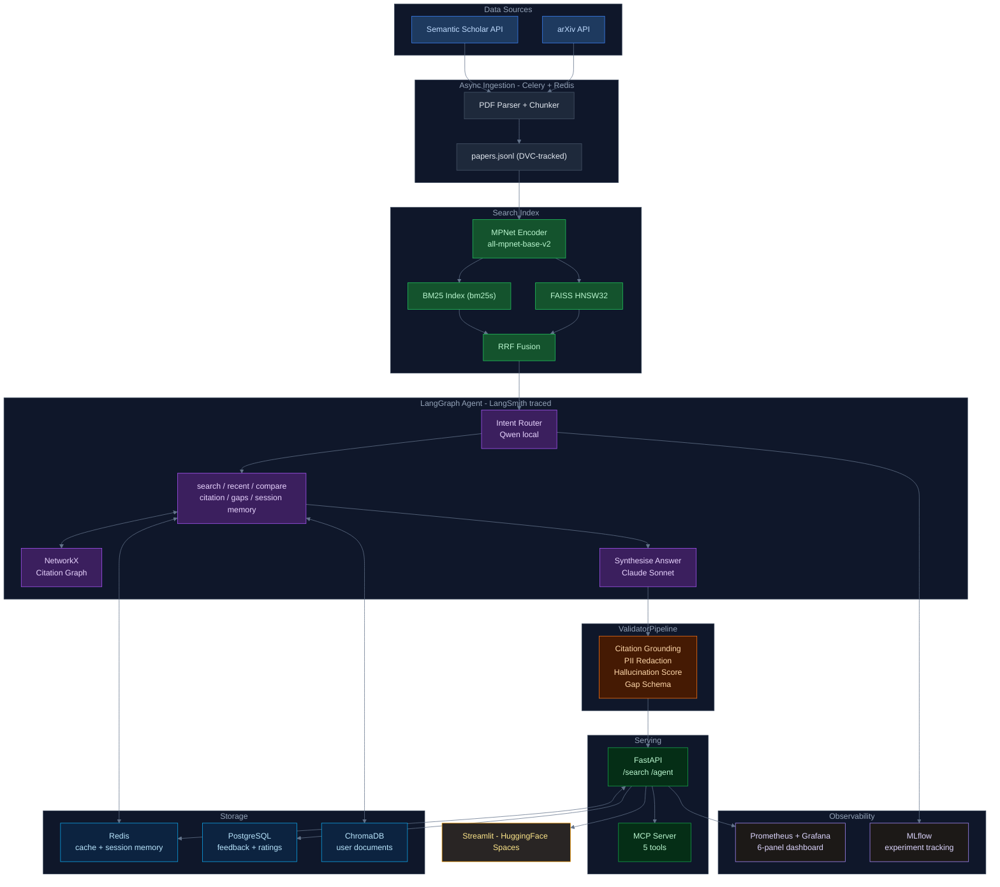

# ResearchMind — Self-hosted Research Intelligence for Domain-Specific ML Researchers

A production-grade research assistant that retrieves, reasons over, and synthesises academic literature. Built as a self-hosted alternative to $50k/yr tools like Cypris and Elicit — combining semantic search, citation graph reasoning, and research gap detection to answer questions that Google Scholar cannot.

**Demo:** [huggingface.co/spaces/kstha/researchmind](https://huggingface.co/spaces/kstha/researchmind)  
**Corpus:** 233 OOD/anomaly detection papers (CV domain, 2019–2025)

---

## What makes it novel

1. **Multi-source heterogeneous retrieval** — arXiv + Semantic Scholar simultaneously
2. **Citation graph reasoning** — NetworkX multi-hop traversal, not just similarity
3. **HyDE benchmarked on its original evaluation domain** — Gao et al. 2022 introduced HyDE on arXiv; we evaluated it there and found it hurts (-15% overall)
4. **Hybrid BM25 + dense retrieval with RRF** — handles author names, model names, acronyms
5. **SPECTER2 domain-adapted embedding benchmark** vs all-mpnet, bge-small
6. **Research gap detection** — structured LLM analysis finding white space (the $50k Cypris use case)
7. **Feedback-driven index improvement loop** — PostgreSQL → k-means clustering → re-chunking

---

## Benchmarks

All results logged to MLflow. Every number has a corresponding run.

### Table 1 — Embedding model selection

Evaluated on 60 synthetic queries (30 semantic + 30 technical) over a 5,000-paper corpus.

| Model | Recall@10 | Semantic Recall | Technical Recall | Throughput (docs/sec) | P95 Latency | Selected |
|---|---|---|---|---|---|---|
| SPECTER2 base + adapters | 0.92 | 0.83 | 1.00 | 498 | 17.5ms | |
| bge-small-en-v1.5 | 0.95 | 0.90 | 1.00 | 1,566 | 10ms | |
| **all-mpnet-base-v2** | **0.97** | **0.93** | **1.00** | **542** | **12ms** | ✓ |

MPNet leads on semantic recall (0.93) — the primary failure mode in research search. SPECTER2's citation-proximity training objective does not generalise to topic-based retrieval.

### Table 2 — FAISS index selection

| Index | Recall@10 | P50 Latency | P95 Latency | Build Time | Selected |
|---|---|---|---|---|---|
| Flat (brute force) | 0.97 | 4.5ms | 5.5ms | 0.026s | |
| IVF100 (inverted file) | 0.58 | <1ms | <1ms | 0.082s | |
| **HNSW32 (graph-based)** | **0.97** | **<1ms** | **0.5ms** | **0.075s** | ✓ |

IVF100 recall collapses to 0.58 — at 50 vectors per cluster it sits at the minimum training threshold. HNSW32 matches Flat recall at sub-millisecond latency.

### Table 3 — Retrieval strategy (Phase 3)

200-query test set across 5 categories. Standard retrieval is the production baseline.

| Mode | Comparative | Factual | Gap Detection | Multi-hop | Temporal | Overall |
|---|---|---|---|---|---|---|
| **Standard** | **0.700** | **0.725** | **0.575** | **0.700** | 0.675 | **0.675** |
| Rewrite | 0.725 | 0.700 | 0.550 | 0.700 | **0.700** | 0.675 |
| HyDE | 0.650 | 0.650 | 0.350 | 0.625 | 0.575 | 0.570 |

HyDE was expected to give +22% on short ambiguous queries (Gao et al. 2022). Actual result: -15% overall. Gap detection queries ask about unsolved problems; HyDE generates abstracts describing solutions, drifting the embedding in the wrong direction.

### Table 4 — LangGraph agent routing accuracy (Phase 4)

110-query labeled test set, 22 queries per intent. Router: qwen3.5:9b, temperature=0.

| Intent | Accuracy |
|---|---|
| search | 100% (22/22) |
| citation | 100% (22/22) |
| compare | 100% (23/23) |
| gap_detection | 100% (21/21) |
| recent | 100% (21/21) |
| **Overall** | **100% (110/110)** |

### Table 5 — Validator pipeline (Phase 5)

20-query evaluation (10 search + 10 gap_detection).

| Validator | Pass Rate | Avg Score |
|---|---|---|
| CitationGroundingValidator | 100% | 1.000 |
| PIIRedactionValidator | 100% | 1.000 |
| HallucinationScoreValidator | 100% | 0.799 |
| ResearchGapSchemaValidator | 100% | 1.000 |
| **Overall block rate** | **0%** | — |

Hallucination score (0.80) is cosine similarity between answer embedding and mean retrieved chunk embedding. Custom pipeline — no guardrails-ai cloud dependency.

### Phase 6 — Redis cache + Celery + feedback loop

| Metric | Value |
|---|---|
| Cold avg latency | 9.66s |
| Warm avg latency | 8.49s |
| Citation query cache reduction | 93% (3.14s → 0.23s) |
| /search p95 (Locust, 80 users) | 2.1s |
| /agent p95 (Locust, 80 users) | 6.2s |
| Total throughput | 15 RPS at 80 concurrent users |

---

## Architecture



```
Semantic Scholar API ──┐
arXiv API ─────────────┴── Ingestion Pipeline ── papers.jsonl (DVC)
                                    │
                          ┌─────────┴─────────┐
                     MPNet Encoder          bm25s
                          │                   │
                    FAISS HNSW32         BM25 Index
                          └─────────┬─────────┘
                               RRF Fusion
                                    │
                           RetrieverService
                                    │
                          LangGraph Agent (7 tools)
                          ├── search_corpus
                          ├── search_recent
                          ├── trace_citation_graph (NetworkX)
                          ├── compare_methodologies
                          ├── detect_research_gaps
                          ├── read_session_memory (Redis)
                          └── synthesise_answer
                                    │
                         ValidatorPipeline (4 validators)
                                    │
                              FastAPI /agent
                         ┌──────────┴──────────┐
                    Redis Cache            PostgreSQL
                    (query cache,          (feedback store,
                    session memory)         ratings, RAGAS)
```

---

## Tech Stack

| Layer | Technology |
|---|---|
| Embeddings | all-mpnet-base-v2 (benchmarked vs SPECTER2, bge-small) |
| Retrieval | FAISS HNSW32, bm25s, RRF fusion |
| Vector store (user docs) | ChromaDB |
| Citation graph | NetworkX |
| Agent | LangGraph StateGraph |
| Agent observability | LangSmith |
| LLM (synthesis, gaps) | Claude Sonnet (Anthropic) |
| LLM (routing, rewrite) | Qwen3.5-9B / Qwen3.6-27B (Ollama local) |
| Validation | Custom pipeline — 4 validators |
| Evaluation | RAGAS |
| Async ingestion | Celery + Redis (eventlet) |
| Caching | Redis |
| Feedback storage | PostgreSQL |
| Experiment tracking | MLflow |
| Data versioning | DVC |
| API | FastAPI + Pydantic |
| Observability | Prometheus + Grafana (6-panel dashboard) |
| Load testing | Locust |
| MCP server | 5 tools |
| Demo | Streamlit (HuggingFace Spaces) |
| Container | Docker + Docker Compose |

---

## How to Run

```bash
git clone https://github.com/stharajkiran/ResearchMind.git
cd ResearchMind
uv venv && uv sync
cp .env.example .env  # add ANTHROPIC_API_KEY, REDIS_URL, POSTGRES_DSN

# Start all services
docker compose up redis postgres mlflow

# Start the API
uv run uvicorn api.app:app --reload

# Run the Streamlit demo
uv run streamlit run demo/Home.py

# Run with demo corpus (no Ollama required)
DEMO_MODE=true INDEX_PHASE=demo uv run uvicorn api.app:app --reload
```

### Reproduce benchmarks

```bash
# Phase 1 — embedding + FAISS benchmarks
uv run python src/researchmind/evaluation/embedding_benchmark.py
uv run python src/researchmind/evaluation/faiss_benchmark.py

# Phase 3 — retrieval strategy A/B
uv run python src/researchmind/evaluation/phase3_eval.py

# Phase 4 — routing accuracy
uv run python src/researchmind/evaluation/phase4_eval.py

# Phase 5 — validator pipeline
uv run python src/researchmind/evaluation/phase5_eval.py

# Phase 6 — latency + load test
uv run python src/researchmind/evaluation/phase6_eval.py
uv run locust -f locustfile.py
```

---

## Commercial context

This targets the same problem as:
- **Cypris** — 500M+ data points, enterprise R&D intelligence, $50k+/yr
- **PatSnap Eureka** — GPT-powered answers grounded in patents and publications
- **Elicit** — systematic literature review for researchers

The ingestion, retrieval, and serving layers are kept separate intentionally. Swapping to a different domain (patents, legal, financial) requires changing data sources and corpus — not the agent or API.
