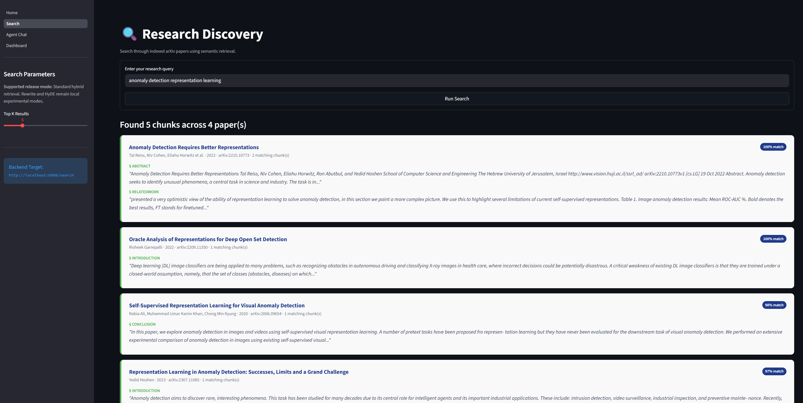
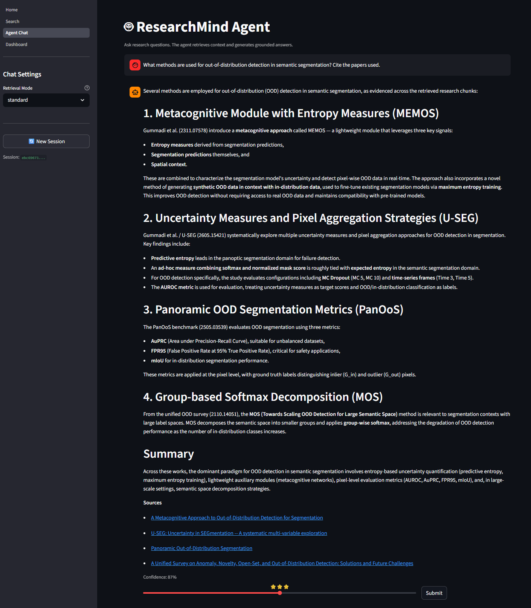
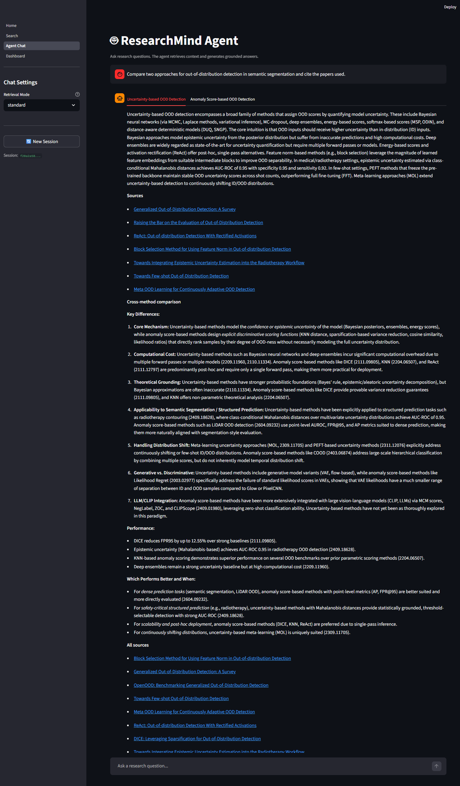
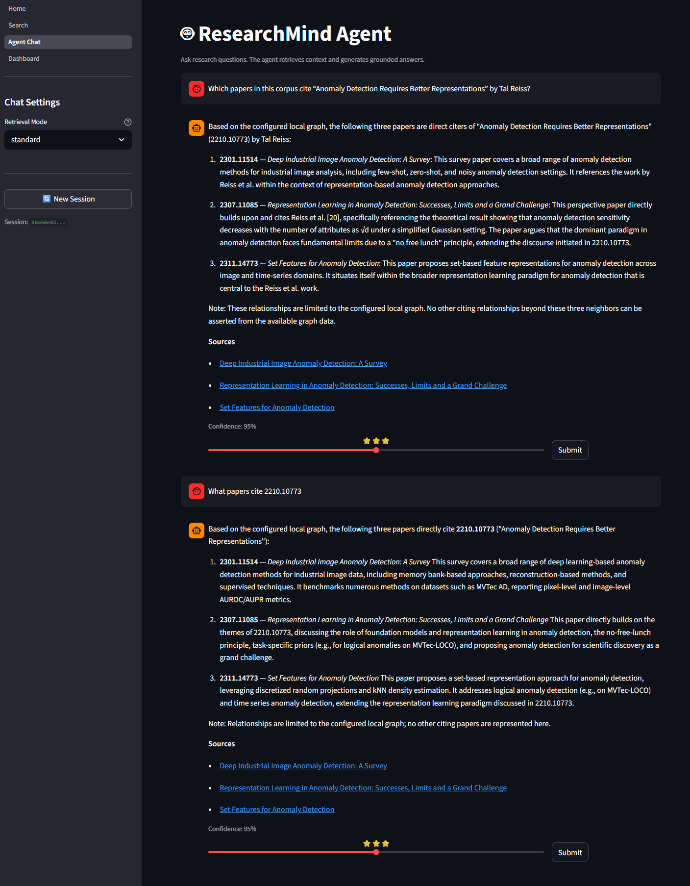
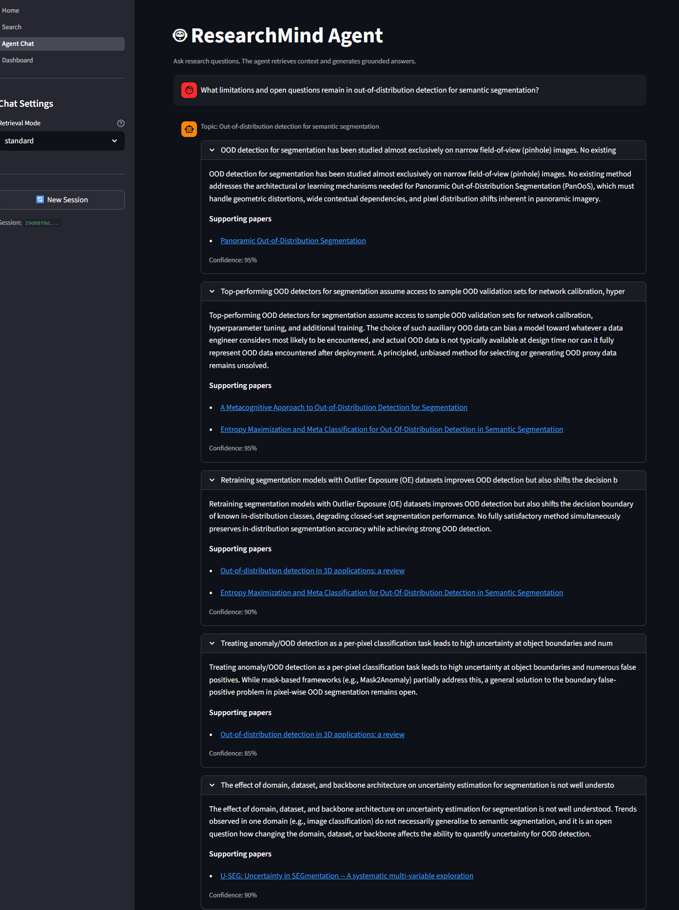
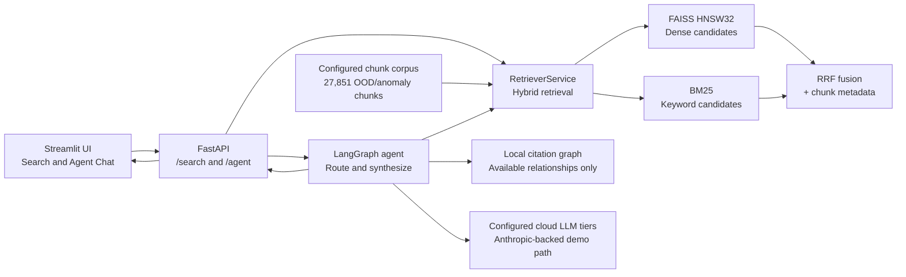
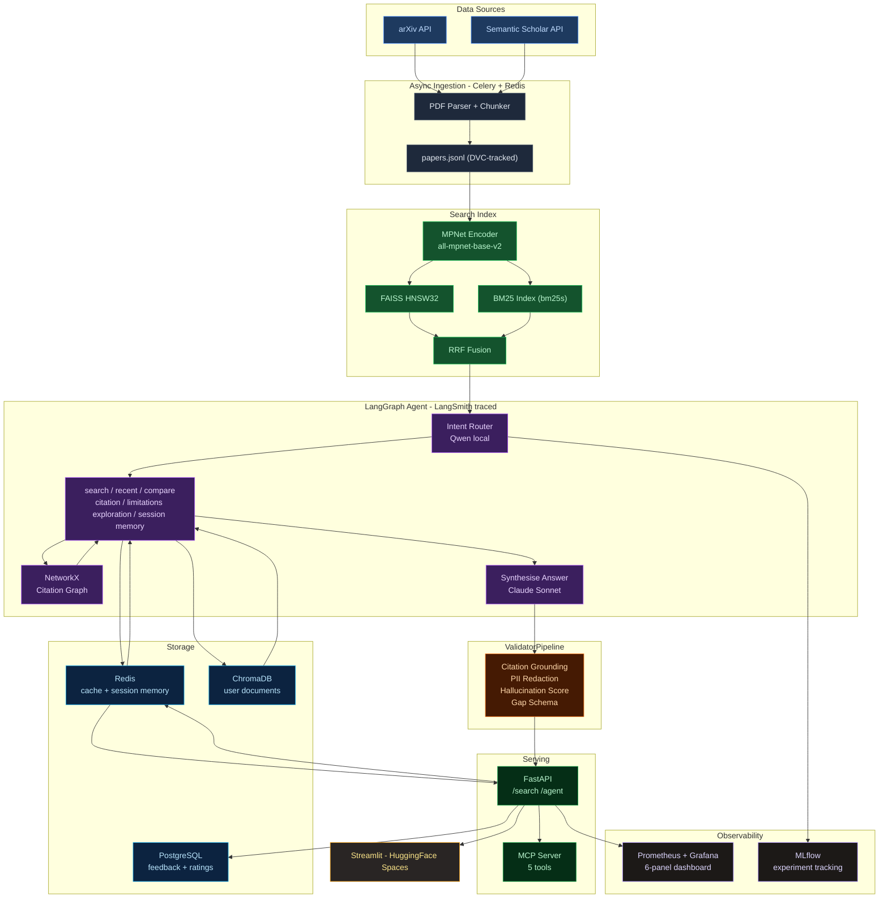

# ResearchMind — Configurable Literature Assistant

ResearchMind is a configurable literature-assistance project: it retrieves paper evidence, synthesises cited answers, compares methods, and explores available citation relationships. Its ingestion, indexing, retrieval, and serving layers are intentionally separated so that a future corpus can be configured for a different research domain.

**Demonstrated domain:** OOD and anomaly-detection literature in computer vision.
**Supported portfolio release:** the full demonstrated corpus (27,851 indexed chunks), served locally through FastAPI and Streamlit.

> **Release scope:** This is a focused Level 2, single-user portfolio project. ResearchMind does not claim exhaustive coverage, definitive novelty or research-gap discovery, scientific truth, competitor parity, or autonomous research decisions. New domains require their own curated corpus, index build, and evaluation; configurability is a design goal, not a claim that every domain is already validated.

---

## Supported workflows

When a research corpus has been ingested and indexed, a researcher can use
ResearchMind to:

1. **Search paper evidence** — retrieve ranked chunks from the configured
   corpus using hybrid dense and keyword retrieval.
2. **Ask a cited research question** — receive an agent-generated synthesis
   with the paper sources used for the answer.
3. **Compare methods** — request a structured, source-linked comparison of
   methods or approaches represented in the corpus.
4. **Explore citation relationships** — follow available inbound or outbound
   relationships from a retrieved paper in the configured citation graph.
5. **Review candidate limitations or open questions** — inspect structured,
   source-linked observations that require the researcher's own judgement.

The portfolio release verifies these workflows using the OOD/anomaly-detection
corpus. Search results, citations, and open-question outputs are bounded by the
configured corpus and its available metadata.

---

## Demonstrated configuration and dependencies

The verified portfolio release uses `CONFIG_NAME=full`, which selects the
following demonstrated case:

| Area | Demonstrated configuration |
|---|---|
| Research domain | Computer-vision OOD and anomaly detection |
| Corpus boundary | `cs.CV` papers discovered with OOD/anomaly-detection queries; configured date range 2018–2025 |
| Indexed corpus | 27,851 section chunks in `data/processed/full/arxiv_ss2_final_chunks.jsonl` |
| Retrieval | `all-mpnet-base-v2`, FAISS HNSW32, BM25, and reciprocal-rank fusion |
| Public search mode | Standard hybrid retrieval. Rewrite and HyDE are local experimental modes and are not exposed in the portfolio demo. |
| Citation data | A local NetworkX graph in `artifacts/citation_graph/full/citation_graph.pkl` |
| Agent provider path | `DEMO_MODE=true` selects configured cloud LLM tiers; cited Agent Chat requires `ANTHROPIC_API_KEY` |
| Streamlit connection | `BACKEND_URL=http://localhost:8000` |

### Artifact availability

The demonstrated corpus, retrieval indexes, and citation-graph artifact are
ignored by Git and are not included in a normal repository clone. For the
verified portfolio configuration, download the
[v0.1.1 artifact bundle](https://github.com/stharajkiran/ResearchMind/releases/download/v0.1.1/researchmind-full-artifacts-v0.1.1.zip)
and its
[checksum manifest](https://github.com/stharajkiran/ResearchMind/releases/download/v0.1.1/researchmind-full-artifacts-v0.1.1.manifest.sha256),
then extract the bundle at the repository root. The supported setup path is
documented in the local-run section below.

### Optional services and keys

- `DATABASE_URL` or `POSTGRES_DSN` enables feedback persistence. When neither
  is set, the feedback store is inactive.
- `REDIS_URL` enables caching and session storage. When it is unset, the cache
  backend is a no-op.
- `DEEPSEEK_API_KEY` is only needed when using a configured DeepSeek-compatible
  LLM tier; it is not required by the verified Anthropic-backed demo path.
- Semantic Scholar, OpenAlex, and AWS credentials are for ingestion or corpus
  rebuilding, not for searching an already-built local corpus.

No secret belongs in the repository. The embedding model may download on first
use if it is not already available in the local model cache.

---

## Release verification evidence

| Evidence | Result | What it establishes |
|---|---:|---|
| Offline automated test suite | Full suite passed after the final API/UI consistency fixes | `/search` response behavior, request-option propagation, deterministic hybrid retrieval behavior, and graph-bounded citation traversal work without local services or live LLM calls. |
| Search workflow | Manually verified | The UI returns paper-result cards from the demonstrated corpus. |
| Cited Agent Chat | Manually verified | The UI returns a response with source details. |
| Comparison, citation, and limitations workflows | Manually verified | The routed agent returns the expected source-linked workflow outputs. |

This is release verification, not a claim of universal retrieval quality,
scientific correctness, or production reliability. No release-level benchmark
score is claimed until it can be rerun against a versioned corpus and evaluation
set.

## Demo evidence

The following screenshots show the verified portfolio workflows using the
demonstrated OOD/anomaly-detection corpus.

### Search paper evidence



*Hybrid search returns ranked paper cards with the paper title, relevant
section, and evidence excerpt.*

### Cited Agent Chat



*The agent synthesizes retrieved context and exposes the paper sources used for
researcher review.*

### Method comparison



*A comparison request produces method-specific summaries, trade-offs, and
linked supporting papers.*

### Citation exploration



*Citation exploration reports relationships available in the configured local
graph; it does not claim coverage beyond that graph.*

### Limitations and open questions



*This workflow surfaces candidate limitations and open questions with supporting
papers for human review; it does not establish a research gap or scientific
consensus.*

## Known limitations and failure cases

- **Corpus-bounded evidence:** results are limited to the configured corpus,
  metadata, and citation graph. Absence of a result does not establish absence
  from the wider literature.
- **Unrelated queries:** hybrid retrieval can still return superficially similar
  evidence for an out-of-domain query. Relevance-threshold calibration is
  intentionally deferred rather than presented as a finished feature.
- **LLM synthesis:** cited sources identify the papers used by the agent; they
  do not independently prove every generated statement. Researchers must read
  the linked papers before relying on an answer.
- **Limitations/open questions:** this workflow surfaces candidate observations
  from retrieved evidence. It cannot establish a research gap, novelty claim,
  or scientific consensus.
- **External dependence:** Agent Chat requires a configured LLM provider and
  can fail, incur cost, or change behavior with that provider. The embedding
  model may require an initial download.
- **Release scope:** the verified application is a local, single-user demo.
  Multi-user access control, operational monitoring, scaling, recovery, and
  production reliability targets are outside this release.
- **Artifact distribution:** full-demo artifacts are released separately from
  source control in the [v0.1.1 GitHub Release](https://github.com/stharajkiran/ResearchMind/releases/tag/v0.1.1).

---

## Capabilities and experimental work

1. **Multi-source heterogeneous retrieval** — arXiv + Semantic Scholar simultaneously
2. **Citation graph reasoning** — NetworkX multi-hop traversal, not just similarity
3. **HyDE benchmarked on its original evaluation domain** — Gao et al. 2022 introduced HyDE on arXiv; we evaluated it there and found it hurts (-15% overall)
4. **Hybrid BM25 + dense retrieval with RRF** — handles author names, model names, acronyms
5. **SPECTER2 domain-adapted embedding benchmark** vs all-mpnet, bge-small
6. **Candidate limitations/open-questions exploration** — structured, source-grounded analysis for researcher review; it does not prove a research gap
7. **Experimental feedback-driven index-improvement loop** — PostgreSQL → k-means clustering → re-chunking

---

## Historical experimental benchmarks

These are historical experimental results, not production reliability claims. Each table must be interpreted with its stated corpus, evaluation set, and method context; the current demonstrated release is the OOD/anomaly-detection case above.

### Table 1 — Embedding model selection

Evaluated on 60 synthetic queries (30 semantic + 30 technical) over a 5,000-paper corpus.

| Model | Recall@10 | Semantic Recall | Technical Recall | Throughput (docs/sec) | P95 Latency | Selected |
|---|---|---|---|---|---|---|
| SPECTER2 base + adapters | 0.92 | 0.83 | 1.00 | 498 | 17.5ms | |
| bge-small-en-v1.5 | 0.95 | 0.90 | 1.00 | 1,566 | 10ms | |
| **all-mpnet-base-v2** | **0.97** | **0.93** | **1.00** | **542** | **12ms** | ✓ |

MPNet leads on semantic recall (0.93) — the primary failure mode in research search. SPECTER2's citation-proximity training objective does not generalise to topic-based retrieval.

### Table 2 — FAISS index selection

| Index | Recall@10 | P50 Latency | P95 Latency | Build Time | Selected |
|---|---|---|---|---|---|
| Flat (brute force) | 0.97 | 4.5ms | 5.5ms | 0.026s | |
| IVF100 (inverted file) | 0.58 | <1ms | <1ms | 0.082s | |
| **HNSW32 (graph-based)** | **0.97** | **<1ms** | **0.5ms** | **0.075s** | ✓ |

IVF100 recall collapses to 0.58 — at 50 vectors per cluster it sits at the minimum training threshold. HNSW32 matches Flat recall at sub-millisecond latency.

### Table 3 — Retrieval strategy (historical Phase 3)

200-query test set across 5 categories. Standard retrieval was the selected experimental baseline.

| Mode | Comparative | Factual | Limitations/open questions* | Multi-hop | Temporal | Overall |
|---|---|---|---|---|---|---|
| **Standard** | **0.700** | **0.725** | **0.575** | **0.700** | 0.675 | **0.675** |
| Rewrite | 0.725 | 0.700 | 0.550 | 0.700 | **0.700** | 0.675 |
| HyDE | 0.650 | 0.650 | 0.350 | 0.625 | 0.575 | 0.570 |

HyDE was expected to give +22% on short ambiguous queries (Gao et al. 2022). Actual result: -15% overall. *The historical evaluation label was `gap_detection`; its published interpretation is limitations/open-questions exploration. These queries ask about unsolved problems, and HyDE can generate solution-like abstracts that drift the embedding.

### Table 4 — LangGraph agent routing accuracy (Phase 4)

110-query labeled test set, 22 queries per intent. Router: qwen3.5:9b, temperature=0.

| Intent | Accuracy |
|---|---|
| search | 100% (22/22) |
| citation | 100% (22/22) |
| compare | 100% (23/23) |
| limitations/open questions* | 100% (21/21) |
| recent | 100% (21/21) |
| **Overall** | **100% (110/110)** |

### Table 5 — Validator pipeline (Phase 5)

20-query evaluation (10 search + 10 limitations/open-questions queries*).

| Validator | Pass Rate | Avg Score |
|---|---|---|
| CitationGroundingValidator | 100% | 1.000 |
| PIIRedactionValidator | 100% | 1.000 |
| HallucinationScoreValidator | 100% | 0.799 |
| Limitations-schema validator* | 100% | 1.000 |
| **Overall block rate** | **0%** | — |

Hallucination score (0.80) is cosine similarity between answer embedding and mean retrieved chunk embedding. Custom pipeline — no guardrails-ai cloud dependency.

*These labels are renamed for public documentation. The historical internal
intent/schema names remain `gap_detection` and `ResearchGap` in the experiment
code and stored results.

### Experimental Phase 6 — Redis cache + Celery + feedback loop

| Metric | Value |
|---|---|
| Cold avg latency | 9.66s |
| Warm avg latency | 8.49s |
| Citation query cache reduction | 93% (3.14s → 0.23s) |
| /search p95 (Locust, 80 users) | 2.1s |
| /agent p95 (Locust, 80 users) | 6.2s |
| Total throughput | 15 RPS at 80 concurrent users |

---

## Verified release architecture

The portfolio release uses the following local path. Redis, PostgreSQL,
observability services, ingestion workers, and MCP are not required to run this
demonstrated workflow.


```mermaid
flowchart LR
    UI["Streamlit UI\nSearch and Agent Chat"] --> API["FastAPI\n/search and /agent"]

    API --> RET["RetrieverService\nHybrid retrieval"]
    RET --> DENSE["FAISS HNSW32\nDense candidates"]
    RET --> SPARSE["BM25\nKeyword candidates"]
    DENSE --> FUSION["RRF fusion\n+ chunk metadata"]
    SPARSE --> FUSION
    CHUNKS["Configured chunk corpus\n27,851 OOD/anomaly chunks"] --> RET

    API --> AGENT["LangGraph agent\nRoute and synthesize"]
    AGENT --> RET
    AGENT --> GRAPH["Local citation graph\nAvailable relationships only"]
    AGENT --> LLM["Configured cloud LLM tiers\nAnthropic-backed demo path"]
    AGENT --> API
    API --> UI
```

The diagram intentionally excludes optional services. If configured, Redis adds
cache/session storage and PostgreSQL adds feedback persistence; neither changes
the core evidence path above.

### Experimental and post-release architecture

The diagrams below preserve broader experiments and future design directions.
They are not the architecture claim for the published Level 2 release.


```mermaid
flowchart TD
    classDef source   fill:#1e3a5f,stroke:#3b82f6,color:#bfdbfe
    classDef ingest   fill:#1e293b,stroke:#475569,color:#e2e8f0
    classDef index    fill:#14532d,stroke:#22c55e,color:#bbf7d0
    classDef agent    fill:#3b1f5e,stroke:#a855f7,color:#e9d5ff
    classDef validate fill:#451a03,stroke:#f97316,color:#fed7aa
    classDef storage  fill:#0c2340,stroke:#0ea5e9,color:#bae6fd
    classDef obs      fill:#1c1917,stroke:#a78bfa,color:#ddd6fe
    classDef serving  fill:#052e16,stroke:#16a34a,color:#bbf7d0
    classDef demo     fill:#292524,stroke:#f59e0b,color:#fde68a

    subgraph Sources["Data Sources"]
        arXiv["arXiv API"]
        S2["Semantic Scholar API"]
    end

    subgraph Ingestion["Async Ingestion - Celery + Redis"]
        Parser["PDF Parser + Chunker"]
        Corpus["papers.jsonl (DVC-tracked)"]
    end

    subgraph Index["Search Index"]
        Enc["MPNet Encoder\nall-mpnet-base-v2"]
        FAISS["FAISS HNSW32"]
        BM25["BM25 Index (bm25s)"]
        RRF["RRF Fusion"]
    end

    subgraph Agent["LangGraph Agent - LangSmith traced"]
        Router["Intent Router\nQwen local"]
        Tools["search / recent / compare\ncitation / limitations exploration / session memory"]
        NX["NetworkX\nCitation Graph"]
        Synth["Synthesise Answer\nClaude Sonnet"]
    end

    subgraph Validators["ValidatorPipeline"]
        V["Citation Grounding\nPII Redaction\nHallucination Score\nGap Schema"]
    end

    subgraph Storage["Storage"]
        Redis["Redis\ncache + session memory"]
        PG["PostgreSQL\nfeedback + ratings"]
        Chroma["ChromaDB\nuser documents"]
    end

    subgraph Obs["Observability"]
        Prom["Prometheus + Grafana\n6-panel dashboard"]
        MLflow["MLflow\nexperiment tracking"]
    end

    subgraph Serving["Serving"]
        API["FastAPI\n/search  /agent"]
        MCP["MCP Server\n5 tools"]
    end

    Demo["Streamlit - HuggingFace Spaces"]

    arXiv --> Parser
    S2 --> Parser
    Parser --> Corpus
    Corpus --> Enc
    Enc --> FAISS
    Enc --> BM25
    FAISS --> RRF
    BM25 --> RRF

    RRF --> Router
    Router --> Tools
    Tools --> NX
    NX --> Tools
    Tools --> Redis
    Redis --> Tools
    Tools --> Chroma
    Chroma --> Tools
    Tools --> Synth
    Synth --> V
    V --> API

    API --> MCP
    API --> Demo
    API --> Redis
    Redis --> API
    API --> PG
    API --> Prom
    Router --> MLflow

    class arXiv,S2 source
    class Parser,Corpus ingest
    class Enc,FAISS,BM25,RRF index
    class Router,Tools,NX,Synth agent
    class V validate
    class Redis,PG,Chroma storage
    class Prom,MLflow obs
    class API,MCP serving
    class Demo demo
```

```
Semantic Scholar API ──┐
arXiv API ─────────────┴── Ingestion Pipeline ── papers.jsonl (DVC)
                                    │
                          ┌─────────┴─────────┐
                     MPNet Encoder          bm25s
                          │                   │
                    FAISS HNSW32         BM25 Index
                          └─────────┬─────────┘
                               RRF Fusion
                                    │
                           RetrieverService
                                    │
                          LangGraph Agent (7 tools)
                          ├── search_corpus
                          ├── search_recent
                          ├── trace_citation_graph (NetworkX)
                          ├── compare_methodologies
                          ├── limitations/open-questions exploration
                          ├── read_session_memory (Redis)
                          └── synthesise_answer
                                    │
                         ValidatorPipeline (4 validators)
                                    │
                              FastAPI /agent
                         ┌──────────┴──────────┐
                    Redis Cache            PostgreSQL
                    (query cache,          (feedback store,
                    session memory)         ratings, RAGAS)
```

---

## Implemented and experimental components

| Layer | Technology |
|---|---|
| Embeddings | all-mpnet-base-v2 (benchmarked vs SPECTER2, bge-small) |
| Retrieval | FAISS HNSW32, bm25s, RRF fusion |
| Vector store (user docs) | ChromaDB |
| Citation graph | NetworkX |
| Agent | LangGraph StateGraph |
| Agent observability | LangSmith |
| LLM (synthesis, limitations exploration) | Claude Sonnet (Anthropic) |
| LLM (routing, rewrite) | Qwen3.5-9B / Qwen3.6-27B (Ollama local) |
| Validation | Custom pipeline — 4 validators |
| Evaluation | RAGAS |
| Async ingestion | Celery + Redis (eventlet) |
| Caching | Redis |
| Feedback storage | PostgreSQL |
| Experiment tracking | MLflow |
| Data versioning | DVC |
| API | FastAPI + Pydantic |
| Observability | Prometheus + Grafana (6-panel dashboard) |
| Load testing | Locust |
| MCP server | 5 tools |
| Demo | Streamlit (HuggingFace Spaces) |
| Container | Docker + Docker Compose |

---

## Run the verified local release

The portfolio demo requires the full-corpus artifact bundle in addition to the
source repository. Download
[`researchmind-full-artifacts-v0.1.1.zip`](https://github.com/stharajkiran/ResearchMind/releases/download/v0.1.1/researchmind-full-artifacts-v0.1.1.zip)
from the [v0.1.1 GitHub Release](https://github.com/stharajkiran/ResearchMind/releases/tag/v0.1.1),
then extract it at the repository root so these repository-relative paths
exist:

- `data/processed/full/arxiv_ss2_final_chunks.jsonl`
- `artifacts/indexes/full/`
- `artifacts/citation_graph/full/citation_graph.pkl`

Install the project and create a local environment file:

```powershell
uv sync
Copy-Item .env.example .env
```

In `.env`, set `ANTHROPIC_API_KEY` and retain the verified release settings:

```text
CONFIG_NAME=full
DEMO_MODE=true
BACKEND_URL=http://localhost:8000
```

Start the API, then start Streamlit in a second terminal:

```powershell
uv run uvicorn api.app:app --host 127.0.0.1 --port 8000
uv run streamlit run demo/Home.py
```

To run the offline portfolio test suite:

```powershell
uv run pytest -q
```

The test suite does not require the artifact bundle, database, Redis, or live
LLM credentials.

## Historical and experimental run commands

```bash
git clone https://github.com/stharajkiran/ResearchMind.git
cd ResearchMind
uv venv && uv sync
cp .env.example .env  # add ANTHROPIC_API_KEY, REDIS_URL, POSTGRES_DSN

# Start all services
docker compose up redis postgres mlflow

# Start the API
uv run uvicorn api.app:app --reload

# Run the Streamlit demo
uv run streamlit run demo/Home.py

# Run with demo corpus (no Ollama required)
DEMO_MODE=true INDEX_PHASE=demo uv run uvicorn api.app:app --reload
```

### Reproduce benchmarks

```bash
# Phase 1 — embedding + FAISS benchmarks
uv run python src/researchmind/evaluation/embedding_benchmark.py
uv run python src/researchmind/evaluation/faiss_benchmark.py

# Phase 3 — retrieval strategy A/B
uv run python src/researchmind/evaluation/phase3_eval.py

# Phase 4 — routing accuracy
uv run python src/researchmind/evaluation/phase4_eval.py

# Phase 5 — validator pipeline
uv run python src/researchmind/evaluation/phase5_eval.py

# Phase 6 — latency + load test
uv run python src/researchmind/evaluation/phase6_eval.py
uv run locust -f locustfile.py
```
